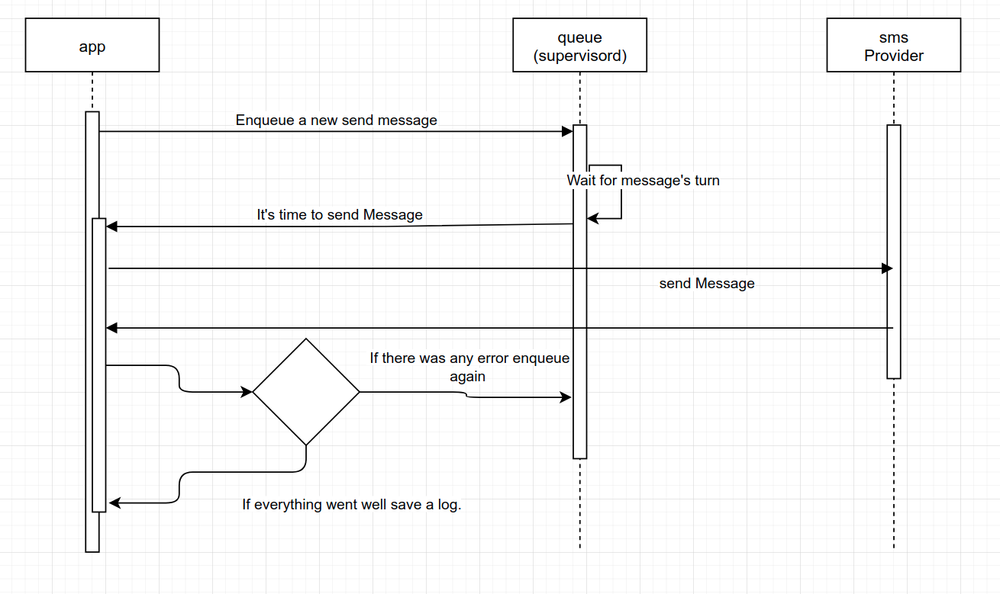

# sms-gateway

## Design decisions

### Since the flow should be async we use a queue.

[]("")

###

## Docker workflow

### Building

```shell
docker-compose up -d
docker-compose --rm composer install
docker-compose --rm artisan migrate:fresh --seed
docker-compose --rm npm install
docker-compose --rm npm run dev
```

### Running tests

```
docker-compose --rm run artisan test
```

## Local development workflow

```
composer install
php artisan migrate:fresh -seed
php artisan queue:work
php artisan serve
```

### running tests
```
./vendor/bin/phpunit
```

## How to add new sms provider?

- Implement `SMSAdapter.php` interface.

```php
<?php
class AwesomeSMSProvider implement SMSAdapter {
    public const SMS_PROVIDER_NAME = "AWESOME_PROVIDER";

    public function __construct($apiKey,$sender)
    {
        $this->apiKey = $apiKey;
        $this->sender = $sender;
    }

    public function sendMessage()
    {
        // send you message here
        // throw SMSException on erro
    }
}
```

- Add any config values that is needed for your `AwesomeSMSProvider` class to initialize in `.env` file.

```
#....
SMS_PROVIDER=AWESOME_PROVIDER
#....

AWESOME_API_KEY=1233333
AWESOME_SENDER=10001
```

- We use Laravel's default `DI` container. Therefore in `AppServiceProvider.php` we tell the container how our class should be built.

```php
<?php
//....
class AppServiceProvider extends ServiceProvider
{
    public function register()
    {
        $this->app->bind(SMSAdapter::class, function () {

            switch (env('SMS_PROVIDER')) {
                // ...
                // Here you tell the container how to build our AwesomeSMSProvider class
                case 'AWESOME_PROVIDER':
                    return new AwesomeSMSProvider(
                        env('AWESOME_API_KEY'),
                        env('AWESOME_SENDER')
                    );
                //...
            }
        });
    }
```
